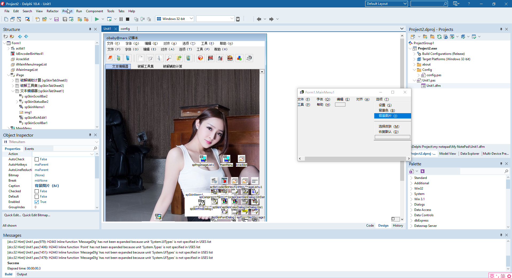

# Delphi记事本


代码是13年前的代码，当时主要的工作还是各种逆向分析。写了一个小工具，应该有很多bug（从之前的电脑找的老代码，后续可能修复过一些问题，不过修复后的代码找不到了。时间久远。）,如果无法使用请自行修改代码（尤其是数值计算部分，以及加密解密部分。**请勿相信程序计算结果！请勿相信程序计算结果！请勿相信程序计算结果！**）。  

代码依赖于：DynamicSkinForm 编译需要安装此插件  

IDE截图：



编辑器截图：


运行效果：https://www.bilibili.com/video/BV16M4y1e79M/?vd_source=f7b69010c8af509b304df2b0db6a868e  

```
obaby@mars
by：obaby
--------------------------
http://oba.by
http://nai.dog
https://h4ck.org.cn
```

